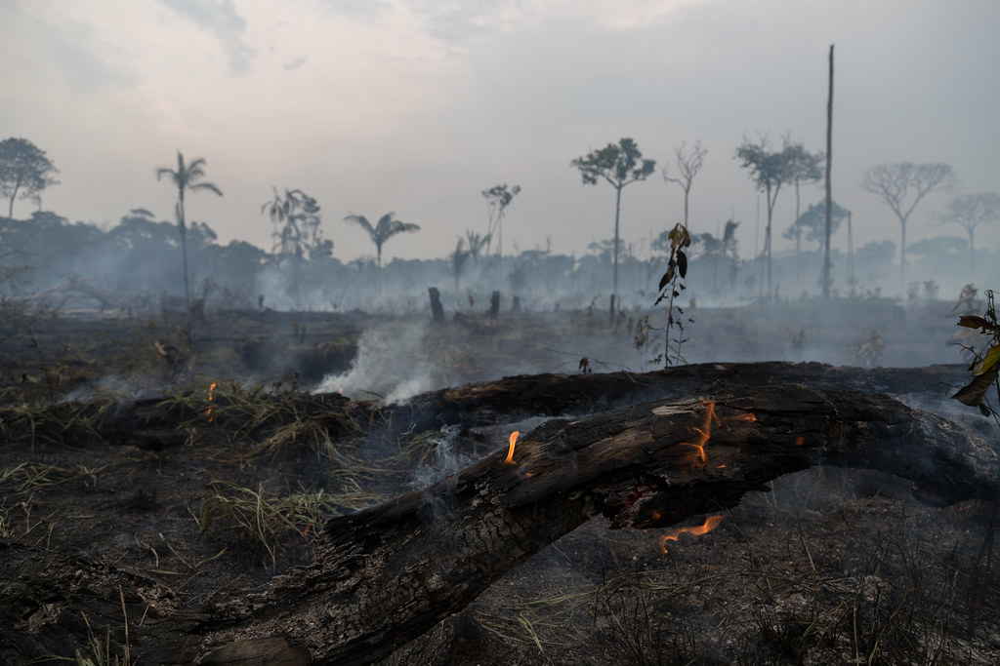

# Análise Exploratório de Dados - Queimadas Florestais Reportadas no Brasil

# Sobre o Projeto

As florestas brasileiras sofrem com a falta de conscientização da sociedade, embora ocorra incêndios provocado pela natureza de forma regular, está havendo uma contribuição humana mais influente, devastando os ecossistemas do país. A grave situação de queimadas junto com o desmatamento insustentável estão resultando na morte de um grande número de plantas e animais.

Neste sentido, o projeto tem o objetivo de realizar uma análise exploratória (EDA - Exploratory Data Analysis) acerca dos dados das queimadas florestais reportadas no Brasil, com o foco de entender melhor onde e quando ocorrem as queimadas florestais, para que assim, seja mais fácil de realizar medidas para preveni-las.

Caso queira saber um pouco mais sobre o projeto, clique <a href="https://github.com/VictorGoulartS/EDA_Queimadas_Florestais/blob/main/analise_exploratoria_queimadas_florestais.ipynb">aqui</a>!

# Índice/Sumário

* [Sobre](#sobre-o-projeto)
* [Sumário](#índice/sumário)
* [Tecnologias Usadas](#tecnologias-usadas)
* [Licença](#licença)

# Tecnologias Usadas

        

# Licença

Este projeto está licenciado sob a Licença MIT,  consulte o arquivo [LICENSE.md](LICENSE.md) para mais detalhes.
